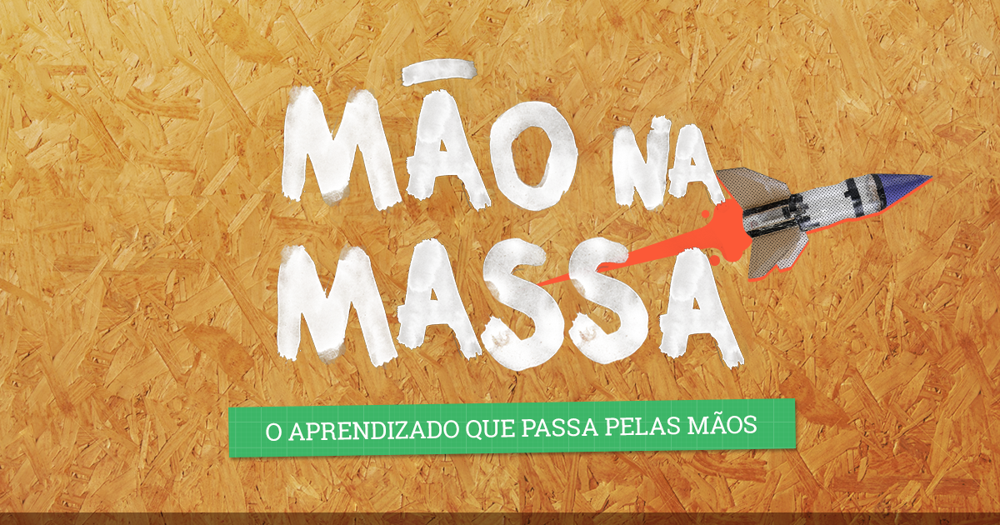

<p align="center">
    
</p>

<h1 align="center">
	Desafio Tech Mão na Massa
</h1>

<p align="center">Semana de inovação</p>

## 🚀 Projeto

Um chatbot para criar cards no Trello.

## 🔧 Tecnologias

- Vite
- StyledComponets
- ReactJS
- Python
- Llama - Meta
- VS Code

## 🚀 Como executar

Clone o projeto e acesse a pasta do mesmo.

```bash
$ git clone https://github.com/taiuanpagini/desafio-mao-na-massa-time2.git
$ cd desafio-mao-na-massa-time2
```

Para iniciá-lo, siga os passos abaixo:

```bash
# Instalar as dependências
$ yarn

# Iniciar o projeto
$ yarn dev
```

O app estará disponível no seu browser pelo endereço http://localhost:3000.

---

Feito com ♥
